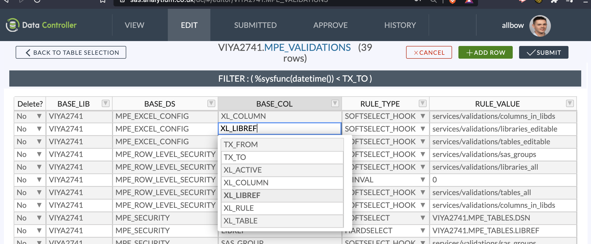
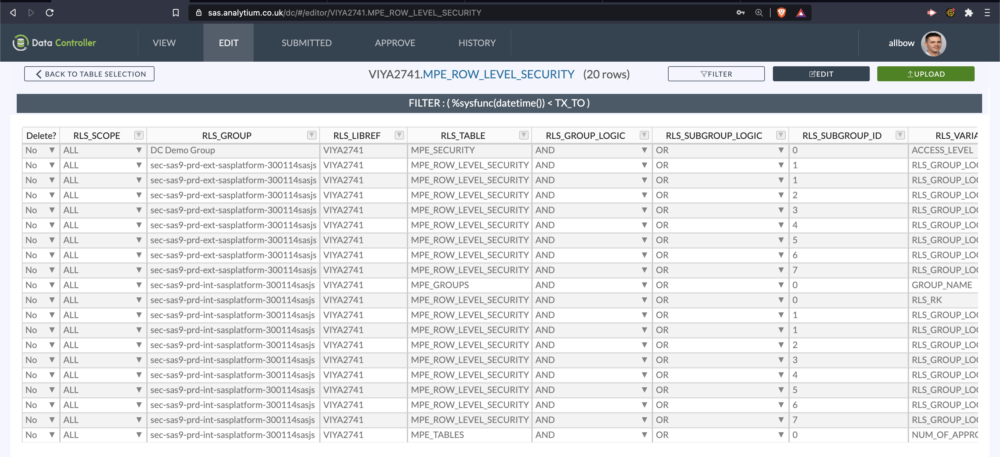
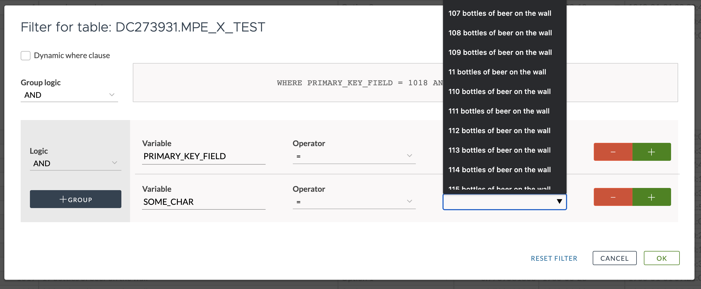
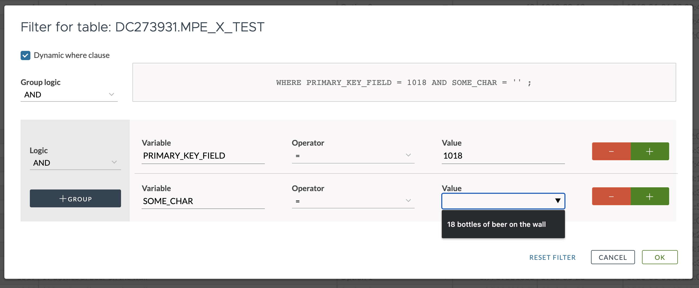

Thanks to a customer investment, we have four fantastic new features!  These are:

- Dynamic Filtering (returned values filtered by other clauses in the same filter)
- Ability to upload Excel formulas into SAS
- Row Level Security for all tables in SAS
- Dynamic Cell Dropdown

That last feature (dynamic cell dropdown) is turning out to be Data Quality Dynamite.  Let's start with it.

## Dynamic Cell Dropdown

This feature allows you to create a backend SAS program to generate the values for the cell dropdown.  The program receives the ROW as input, so you can make the values dependent on other values - such as returning a list of product codes for a particular region, or people within a department.  We are now using it extensively within Data Controller to display tables for a particular library, or columns for a particular table.

The SAS program can live on the directory, or it can also be in a SAS 9 Stored Process or Viya Job.  The dropdown can be "HARD" (user must select a value) or "SOFT" (user can also type their own value).

More info in [documentation](https://docs.datacontroller.io/dynamic-cell-dropdown).

## Row Level Security

This feature allows you to create complex queries to determine which groups can access which rows in which tables (either for the EDIT menu, VIEW menu or both).  If a user is in multiple groups, these rules are joined with an OR condition, allowing additional rows with additional group memberships.  The rules are also applied for data uploads, preventing users from modifying records that they do not have permission to access.

Full details available in the [documentation](https://docs.datacontroller.io/row-level-security).

## Dynamic Filtering

Previously, when using the filter mechanism, all values were always returned in the selection box.

Now, when the dynamic where clause box is checked (which is the default), the values in the _second and subsequent_ filter clauses are filtered by the previous filter clause settings, eg:

## Excel Formulas

It is now possible to configure certain columns to be extracted as formulae, rather than raw values. The target column must be character, and it should be wide enough to support the longest formula in the source data. If the order of values is important, you should include a row number in your primary key.

`video: [Retain Formulas when Loading Excel to SAS](https://www.youtube-nocookie.com/embed/Reg803vI2Ak)`

Full configuration information in the [docs](https://docs.datacontroller.io/excel).

## Other Stuff

Further updates since the [v3.11 release](/version-3-11-release-notes-redshift-locale-proc-transpose) include:

- Support for E8601DA and B8601DA date formats
- Addition of a max-depth option in Data Lineage to enable exploration when the lineage is HUGE
- Optimisations to enable rendering of large lineage diagrams, and options to perform background rendering into PNG / SVG files
- Fixed bug where some restricted users could view all approve history
- Fixed bug where users could not see their list of submits
- Excel Exports are now enabled where SAS/ACCESS for PC Files is not licensed
- Previously, not all Viya Users were being returned in the User Navigator.  They are now.

Would you like to give Data Controller a whirl?  We're waiting to [hear from you](/contact)!
