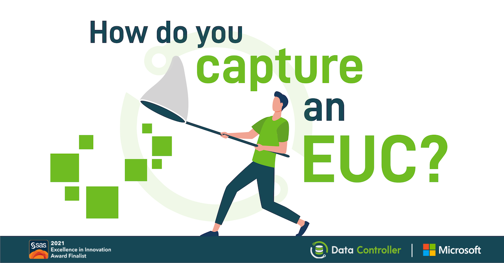
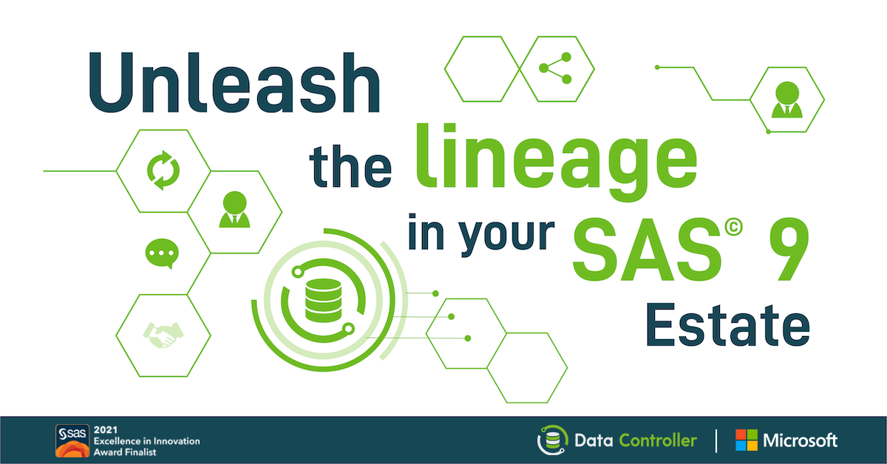
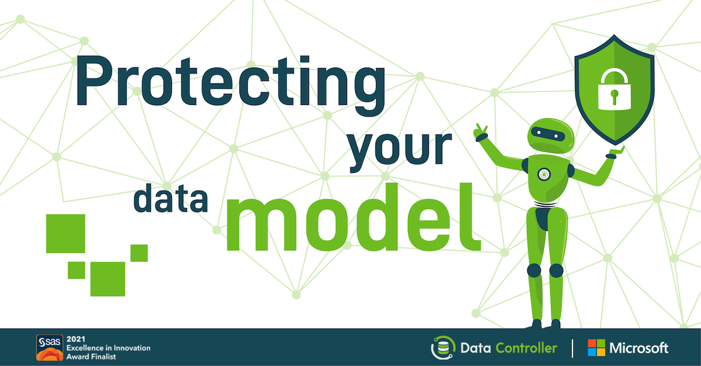

Data Controller for SAS® was a finalist in the 2021 "Excellence in Innovation" award!

Each year, SAS recognises a partner that has demonstrated outstanding innovation by adding their own intellectual property to SAS software in order to uniquely solve a complex customer business problem. [Analytium](https://sasapps.io) is one of the "chosen four", from among over 1800 partners globally!

## Award Process

There was a strict 15 minute virtual presentation, that began with a 3-4 minute "customer elevator pitch" to explain the customer value of the solution. The remaining time delved into the technical side of things, plus Q&amp;A. There were around 12 SAS employees on the call, with a mix of backgrounds, and assessment was made across three dimensions:

- Does the solution represent unique innovation?
- Is the solution a valuable addition to SAS Software (ie, "fills a gap")?
- Does the solution solve a customer need?

For our part, we began the presentation with an animated video, that explored some of the pain points solved by Data Controller, such as:

- Batch stability
- End User Computing
- Audit investigations

<iframe width="560" height="315" src="https://www.youtube-nocookie.com/embed/M8hafkS4zY4" title="YouTube video player" frameborder="0" allow="accelerometer; autoplay; clipboard-write; encrypted-media; gyroscope; picture-in-picture" allowfullscreen></iframe>

On the innovation side, we talked about some of the following unique capabilities we have built to deliver customer value:

- Ability to deploy without a web server (streaming app capability)
- The DevOps framework, which we have open-sourced ([SASjs](https://sasjs.io))
- Cross SAS-Platform technology (Viya, SAS 9, and soon - desktop SAS also)

As well as an overview of the list of features we have built, to extend the value of SAS Software:

- SAS 9[ Data Lineage diagrams](https://docs.datacontroller.io/videos/#data-lineage) that can be exported as PNG, SVG or CSV
- [Zero Code data capture](/5-zero-code-ways-to-import-excel-into-sas/) with data model protection
- [Row Level Security](/row-level-security/) for any SAS-connected table
- Browser based SAS 9 Metadata explorer
- [Dynamic Cell Dropdowns](https://docs.datacontroller.io/dynamic-cell-dropdown/)
- Automated [EUC capture](/euc-management-system/)
- [Excel Formula capture](https://docs.datacontroller.io/excel/)
- [Bitemporal](/bitemporal-historisation-and-the-sas-dds/) Uploads

## Data Controller for SAS® and Microsoft

We are now putting the badges to good use in our upcoming LinkedIn campaign!  [Analytium](https://sasapps.io) are both SAS and Microsoft partners, and Data Controller for SAS® is listed on the [Azure Marketplace](https://azuremarketplace.microsoft.com/en-us/marketplace/apps/analytiumltd1582389146376.datacontrollerforsas?tab=Overview).

These are the ads we will be running:

Data Controller is free for up to 5 users.  If you'd like to give it a whirl, just [pop us a message](/contact)!
