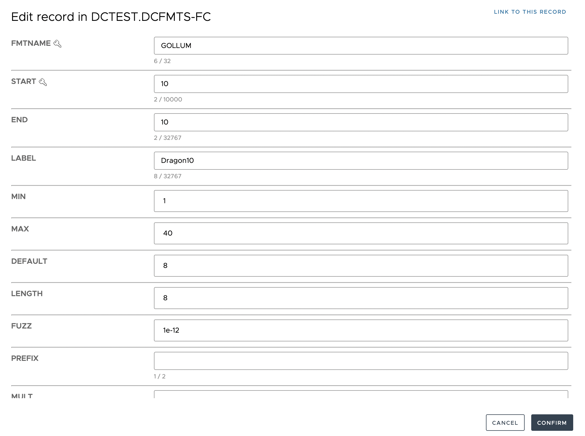
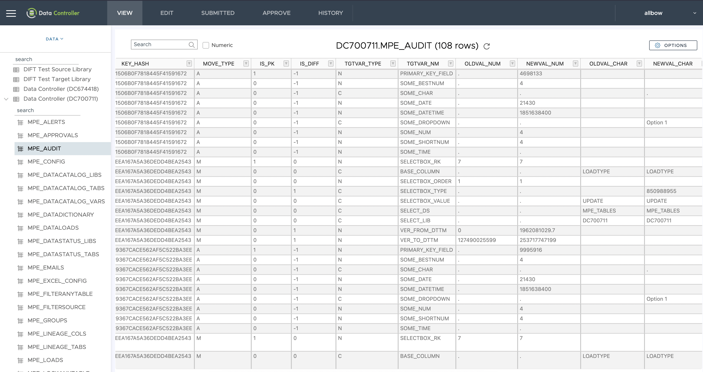

We're excited to announce the new features in the v4 release:

* Ability to VIEW and EDIT values directly in Format Catalogs
* Ability to VIEW and EDIT special SAS missing numeric values (.a, .b etc)
* Audit table (single source for all data modifications in DC)
* Additional metadata on table viewer (Primary Key, labels, lengths, formats)
* Formatted / Unformatted switch on the DIFF screen

As well as the following fixes:

* Identical filter clauses on different tables being mis-assigned (this is the breaking change)
* Filter clauses applied to Excel / CSV / Datalines downloads
* Data values may now contain _leading_ blanks
* Customers may now have a single licence for multiple site ids
* Support for target table record deletion in Excel Uploads

We've also completely refactored the underlying engine for [Dynamic Cell Dropdowns](https://docs.datacontroller.io/dynamic-cell-dropdown) to make it faster, more robust, and easier to test.

We're also pleased to report that all the backend SAS Services now run with [strict mode](https://core.sasjs.io/mp__init_8sas.html) enabled, ensuring that SAS will 'fail fast' in case of data issues.

Some more background on our major features:

## View & Edit Format Catalogs

Data Controller allows you to view and edit formats _directly_ in the catalog.  It does not require the maintenance of a secondary "cntlin" table!  This ensures that the formats you are viewing / editing are indeed, the latest ones.

All of the usual Data Controller features are available for formats too, including:

* Configure HOOK scripts to run before / after a change or approval
* Locking mechanism to avoid issues with parallel updates
* Make changes in the web, or via Excel or CSV upload
* Edit individual format entries on dedicated screen
* Create complex filters (and save filtered views)
* Full-table (catalog) search for specific values
* Download in Excel, CSV or Datalines formats
* Export the DDL (in various flavours)
* Mark format entries for deletion

Information on configuration is available in the [documentation](https://docs.datacontroller.io/formats)

## View & Edit SAS Special Missing Numerics

Did you know that, in addition to a regular missing value in SAS (`.`), there are 27 other types of missing?  They are represented by the letters a-z and an underscore (`._`).

These values can now be both viewed and edited in Data Controller following an update to the [SASjs Adapter](https://github.com/sasjs/adapter#variable-types).

`video: [Retain Formulas when Loading Excel to SAS](https://www.youtube-nocookie.com/embed/ggrcNr23Jzw)`

There is nothing extra to configure for special SAS numerics - they are simply available by default, for numeric cells.

## Audit History Table

Previously, transactional changes made to tables in Data Controller could only be tracked by means of individual CSV files. A user could (and still can) navigate to the HISTORY tab, find their change, and download a zip file containing all relevant information such as the original excel that was uploaded, SAS logs, the changed records (CSV) and the staging dataset.

The issue is that this information did not capture the original, unchanged records (necessary to support rollbacks), nor did it provide a central point for querying the entire change history of a particular variable / record over time.

These issues are now resolved with the introduction of the MPE_AUDIT table.

The macro used to load this table is open source and available [here](https://core.sasjs.io/mp__storediffs_8sas.html).

## Roadmap (7th March 2022)

We continue to update and improve Data Controller.  Upcoming features include:

* PK highlighting for VIEW as well as EDIT tables
* Data Rollback
* Ability to configure individual audit tables (ie, 1 per EDIT table)
* Data Controller API
* Data Controller on Viya 4
* Data Controller on Desktop SAS (using [sasjs/server](https://github.com/sasjs/server))

Did you know Data Controller is free for up to 5 users? [Contact us](/contact) for your copy!
