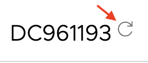
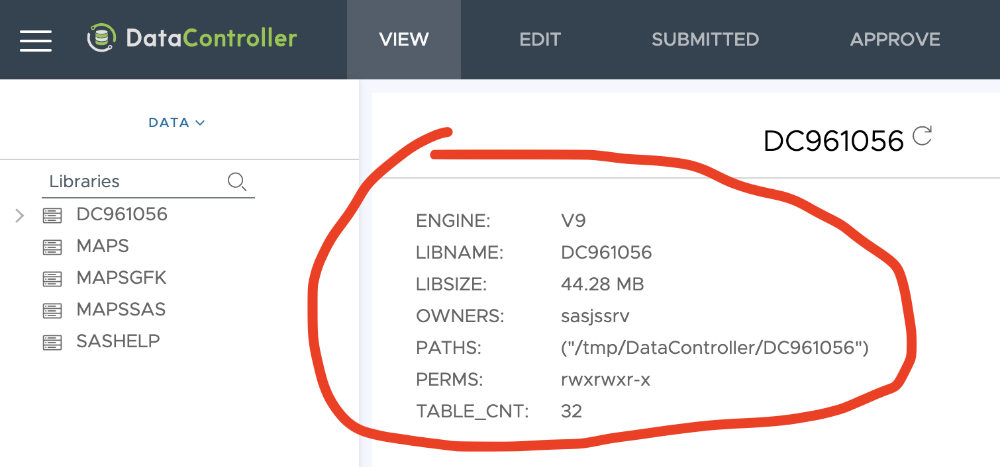
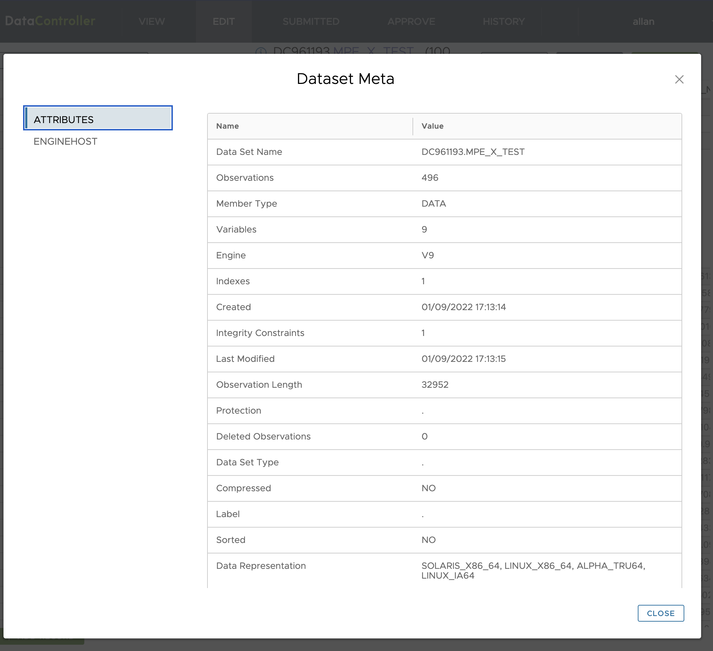
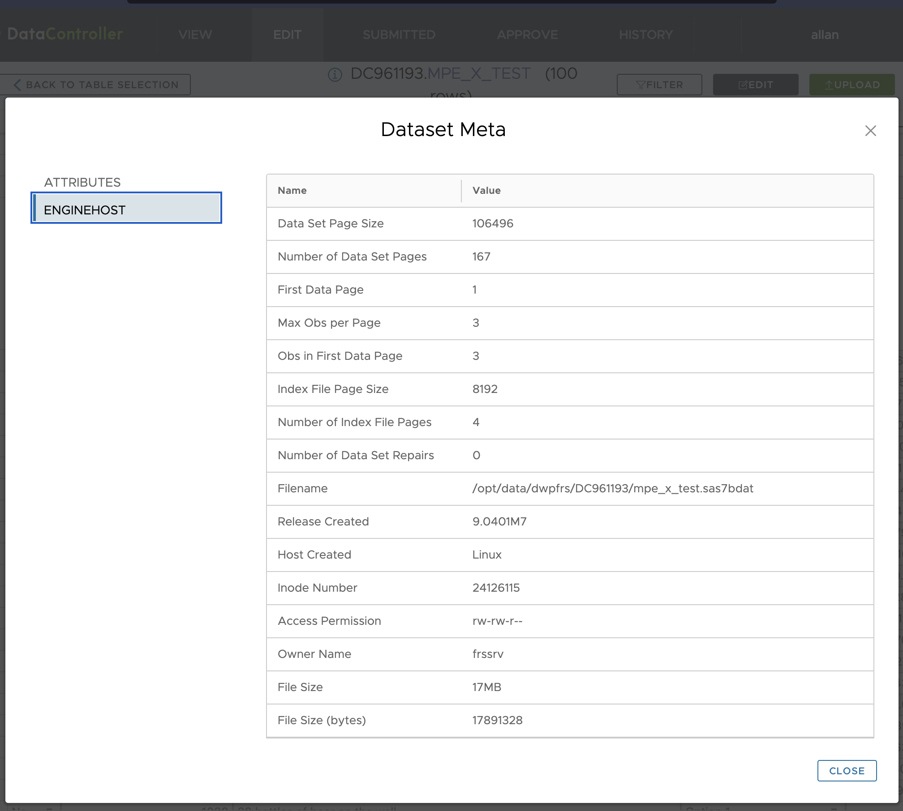

# v5.1 Release

The new features in this release are:

* Refresh the Data Catalog on a per-library basis
* View the Data Catalog info in a new, linkable, 'library info' screen
* View dataset information (proc contents)
* New Forward & Back option in the Edit Record modal
* Tidying / publishing of [source code](https://code.datacontroller.io)

Various fixes have also been delivered, including:

* Removed error dialog when a library is empty
* Loading of formats with different length settings
* Suppress ABORT modal when dynamic filtering
* Dynamic retreival of Server Context when deploying on SAS 9
* Fixes to various edge cases in the FILTER dialog
* Display correct number of actual changed records (Previously capped at 200, the display amount)
* Dropdown values on modified Edge instance are no longer "sticking" (we built a custom modal)
* Fixed issue with `NaN` being displayed when copy/pasting in certain contexts

There is also a significant speed improvement when working with wide tables (hundreds of variables).

## New Features

### Data Catalog Library Refresh

Previously the only way to refresh the Data Catalog was to run the `services/admin/refreshcatalog` service.  Now, any user can refresh it using the refresh button for a specific LIBREF in the VIEW menu.

### Data Catalog Library Info

It is now possible to view the library info on a new (linkable) library page.  Useful metrics such as the engine used, the physical size of the library (if BASE), permissions, table count etc are surfaced.

### Dataset Info

Using the [ds_meta](https://core.sasjs.io/mp__dsmeta_8sas.html) macro a large number of dataset specific metrics are now available on both VIEW and EDIT pages.

This is a handy place to check for common issues such as a lack of dataset compression, or the presence of a significant number of logically deleted records.

### Forwards & Back

You can now move forwards and backwards through observations in the Edit Record modal, FSEDIT style!

`video: [Edit Record Modal in Data Controller for SAS](https://www.youtube-nocookie.com/embed/phXtIXhI_3k)`

### Data Controller Source Code

To assist users, admins and developers with understanding exactly what is going on insde the Data Controller services, we have published the source code to [https://code.datacontroller.io](https://code.datacontroller.io).  The programs are documented using Doxygen and [sasjs doc](https://cli.sasjs.io/doc).

## Bug Fixes

We deployed Data Controller to the SAS environment of a Government customer this year, and we're grateful to them for performing some very extensive and intensive testing!  A fairly large number of issues were found and fixed over the last 3-4 months and so an upgrade is highly recommended for all customers.  The deployment page is [here](https://4gl.uk/dcdeploy).

## Roadmap (3rd September 2022)

The following items are on our 'would like to build' list.  If you're interested in any of these, and there's a commercial opportunity involved, then - let's [chat](https://dataacontroller.io/contact)!

* Admin Screen
* Data Rollback (from UI)
* Data Controller API

