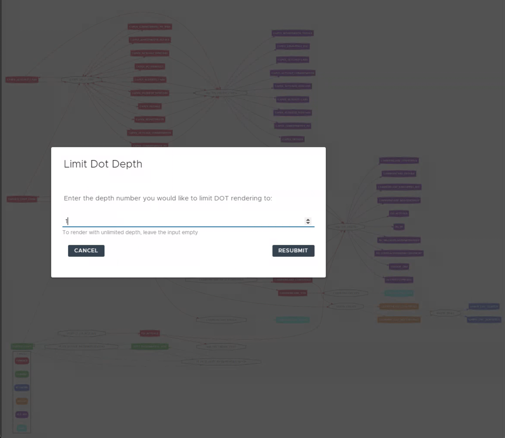

# v5.2 Release

Many of you are telling us that your favourite feature in Data Controller is the Data Lineage explorer!

And recently it's been getting battle tested in some large environments, with sizeable lineage trees. To avoid the need to wait for these trees to render, we've now added the ability to limit lineage depth _before_ generating the lineage.

We've also spent time improving the responsiveness of Data Controller to suit different screen sizes. We've reduced the number of menu items from 5 to 3, and adjusted the way the menu works when Data Controller is accessed from devices such as mobile or tablet.

Furthermore, the following fixes have been deployed:

* Prevent hanging in column lineage when library id not found
* Fix issue with "max_depth" not limiting depth in some cases
* Fix issue with PK fields not shown in dictionary tables
* Escaping of ampersands in file / table lineage
* Fix alignment of the "library info" screen

Finally, since the last release, we also made a demo instance of Data Controller public.  It makes use of the mocking capabilities of [SASjs Server](https://server.sasjs.io) (backend is JS-only).

You can try it out here: [https://demo.datacontroller.io](https://demo.datacontroller.io)

