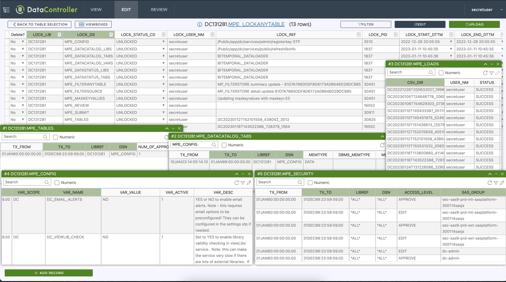

# v5.3 Release

Have you ever examined a record in VIEW or EDIT and needed to compare against data values in other tables (or even other places in the _same_ table)?

With viewboxes, you can now create filtered views (both at column and record level) of up to 6 other tables and arrange them on the same screen.

The tables, filters, and grid position are all saved in the URL, so you can share your view with colleagues.  Primary key fields (determined by column constraints) are shaded.  Column ordering and visibility is configurable.  If the table is editable, it can be opened in edit mode in a new window.

As part of this release we also upgraded the [HandsOnTable](https://handsontable.com/customers/datacontroller) library, which allows us surface a new feature - "copy with header rows".  This can be found in the right click menu.

