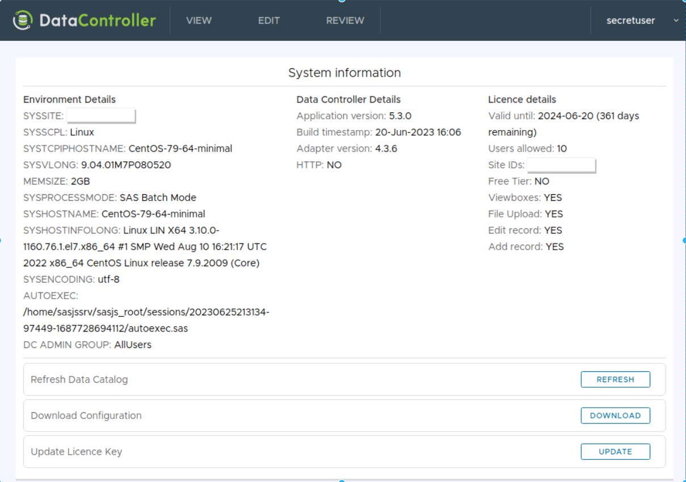

# v6.0

With a (Viya) API explorer, an overhauled (in)format ingestion capability, and now with unlimited users - Data Controller v6 is a major release indeed!

## Viya API Explorer

Following on from the metadata explorer (SAS 9 EBI feature) we have been looking to provide a similar capability for Viya.  And so, we built the API explorer!

This lets you easily trigger the (GET) APIs and explore the responses without having to break open Postman or another development toolkit.  Here's an example of opening a Job and examining the SAS code:

<iframe title="Browsing Viya API in Data Controller" width="560" height="315" src="https://vid.4gl.io/videos/embed/e284f815-a6dc-4998-80bd-152d54cb81a9?title=0" frameborder="0" allowfullscreen="" sandbox="allow-same-origin allow-scripts allow-popups"></iframe>

Here we grab the raw JSON for pasting into VS Code:

<iframe title="Grabbing JSON from Viya APIs with Data Controller" width="560" height="315" src="https://vid.4gl.io/videos/embed/18914633-342b-48f1-9021-bb01a8b33198?title=0&amp;warningTitle=0" frameborder="0" allowfullscreen="" sandbox="allow-same-origin allow-scripts allow-popups"></iframe>

And here we toggle the start / limit parameters to bring back more values:

<iframe title="Adjusting the start and limit params in the Data Controller Viya API Explorer" width="560" height="315" src="https://vid.4gl.io/videos/embed/29cc7a32-75c5-4cd5-8938-b1a7d0e1575d?title=0" frameborder="0" allowfullscreen="" sandbox="allow-same-origin allow-scripts allow-popups"></iframe>

We would love YOUR feedback as to how we can extend this API explorer to make it an even more useful tool!

## Unlimited Users

If you've been following us for a while you've probably heard the '5 users free' tagline.  Well - you will hear it no more, as we now offer **unlimited users for all tier levels**!

That's right, you can download Data Controller (Community Edition) and use it across your entire enterprise TODAY, without spending a penny.

If, however, you would like priority support and full access to all features, we ask that you engage us on <a href="https://datacontroller.io/pricing">paid subscription plan</a>.

## (IN)FORMAT Capabilities

Previously we only supported ingestion of run-of-the-mill SAS formats.  Following customer feedback, we have now expanded this capability to include:

* Informats
* Multilabel Formats
* NotSorted Formats

The addition of these format types broke the data model we were using previously for holding format data.  We had incorrectly assumed that the CNTLOUT dataset could be keyed on TYPE, FMTNAME and START.

In fact, START can be null, and the format data can have complete duplicates (multilabel). Furthermore, the _order_ of records is important (notsorted).  Therefore we have applied a new key (TYPE, FMTNAME, FMTROW) where FMTROW is the index of the record of the format in question.

This means if you insert a row in a format, Data Controller will see this as a CHANGE to all the rows underneath (if they are not duplicates).  This difference in behaviour, as well as the the change in the model, is the "breaking change" in this release (hence major version bump).  It will likely only affect you though if you are using Excel or CSV to upload (in)format data.

This primary key (TYPE, FMTNAME, FMTROW) is now also indicated in VIEW mode.

## Admin Screen

We've added a new screen (under the username dropdown) to show system details as well as a handy set of shortcut buttons for refreshing the data catalog and downloading configuration files.

This screen is also available for regular users (those not in the Data Controller admin group), just without the additional buttons.

## Load More Values

We've added the ability to 'load more' history on the history page, as well as the ability to [show more history by default](https://docs.datacontroller.io/dcc-options/#history_rows)

"More Values" can now also be requested from the selection dropdowns when creating data filters.

## Fixes

Some of the issues we've zapped:

* Enable data-catalog refresh of a single library when invalid libraries are present
* Prevent error when attempting an UNLOCK of an already-unlocked table
* Show Viya avatar when web app is served from a different domain
* Bug with delete-only uploads not appearing in the audit table
* Show special missing values on VIEW screen

## Roadmap

Looking to the future, we are actively tidying up the codebase to publish it as 'source-available' (the source is already available to existing customers).  We are also investigating the HandsOnTable "Formula" feature to see if we can implement it on the EDIT grid.

If you would like to see any new features in DC, or would like to kick the tyres and give it a whirl, do [get in touch](https://datacontroller.io/contact)!

